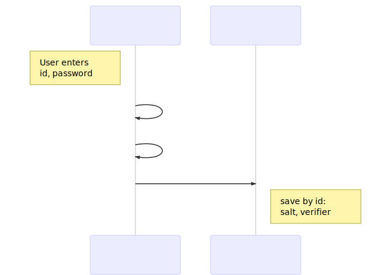
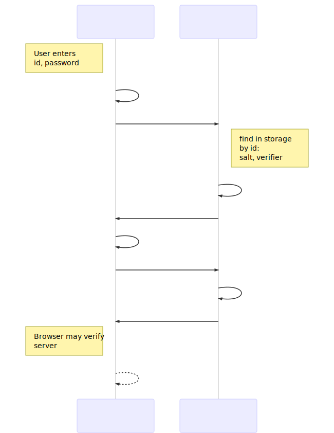

# Midokura TSSRP6a

This library is a TypeScript implementation of [Secure Remote Password](http://srp.stanford.edu/) SRP6a.

SRP allows a user to authenticate to a server without sending the password (zero-knowledge proof of password) using generated private/public keys.

https://en.wikipedia.org/wiki/Secure_Remote_Password_protocol
https://tools.ietf.org/html/rfc5054

## Signup / registration

[](https://mermaidjs.github.io/mermaid-live-editor/#/edit/eyJjb2RlIjoic2VxdWVuY2VEaWFncmFtXG4gICAgcGFydGljaXBhbnQgQiBhcyBCcm93c2VyXG4gICAgcGFydGljaXBhbnQgUyBhcyBTZXJ2ZXJcbiAgICBOb3RlIGxlZnQgb2YgQjogVXNlciBlbnRlcnM8YnIvPmlkLCBwYXNzd29yZFxuICAgIEItPj5COiBzYWx0ID0gY2xpZW50LmdlbmVyYXRlUmFuZG9tU2FsdCgpXG4gICAgQi0-PkI6IGNsaWVudC5nZW5lcmF0ZVZlcmlmaWVyKHNhbHQsIGlkLCBwYXNzd29yZClcbiAgICBCLT4-UzogZW1haWwsIHNhbHQsIHZlcmlmaWVyXG4gICAgTm90ZSByaWdodCBvZiBTOiBzYXZlIGJ5IGlkOjxici8-c2FsdCwgdmVyaWZpZXJcbiIsIm1lcm1haWQiOnsidGhlbWUiOiJkZWZhdWx0In19)

The user requests a registration page, the browser will generate a salt and take the user's identity and password and generate a verifier.  
The browser sends email, salt, verifier to server. The server saves this to storage.

## Signin / login

[](https://mermaidjs.github.io/mermaid-live-editor/#/edit/eyJjb2RlIjoic2VxdWVuY2VEaWFncmFtXG4gICAgcGFydGljaXBhbnQgQiBhcyBCcm93c2VyXG4gICAgcGFydGljaXBhbnQgUyBhcyBTZXJ2ZXJcbiAgICBOb3RlIGxlZnQgb2YgQjogVXNlciBlbnRlcnM8YnIvPmlkLCBwYXNzd29yZFxuICAgIEItPj5COiBjbGllbnQuc3RlcDEoaWQsIHBhc3N3b3JkKVxuICAgIEItPj5TOiBpZFxuICAgIE5vdGUgcmlnaHQgb2YgUzogZmluZCBpbiBzdG9yYWdlPGJyLz5ieSBpZDo8YnIvPnNhbHQsIHZlcmlmaWVyXG4gICAgUy0-PlM6IGIsQiA9IHNlcnZlci5zdGVwMShpZCwgc2FsdCwgdmVyaWZpZXIpXG4gICAgUy0-PkI6IHNhbHQsIEJcbiAgICBCLT4-QjogYSxBLE0xID0gY2xpZW50LnN0ZXAyKHNhbHQsIEIpXG4gICAgQi0-PlM6IEEsTTFcbiAgICBTLT4-UzogTTIgPSBzZXJ2ZXIuc3RlcDIoYiwgQSwgTTEpXG4gICAgUy0-PkI6IE0yXG4gICAgTm90ZSBsZWZ0IG9mIEI6IEJyb3dzZXIgbWF5IHZlcmlmeTxici8-c2VydmVyXG4gICAgQi0tPj5COiBjbGllbnQuc3RlcDMoYSwgTTIpIiwibWVybWFpZCI6eyJ0aGVtZSI6ImRlZmF1bHQifX0)

The user starts an authentication session by entering his id and password.

The id is sent with a request to the server, which finds salt and verifier for that id. Server executes step1 to generate private key `b` and public key `B`, and responds to browser with `salt` and `B`.

The browser generates private key `a`, public key `A` and computes `M1`. Browser makes requests with `A` and `M1`.

Server verifies that the credentials were correct with step2, using `b` and `M1`. If successful, it also takes `A` and generates and responds with `M2`.

Browser may additionally verify the authority of the server from `M2` with step3.

Note: `a` and `b` are generated for one authentication "session" and discarded immediately.

## Usage

See [session test](test/session.test.ts) for actual usage of a complete authentication flow between client and server.

This package's client and server hashing algorithms of course match, and matches Java's [Nimbus SRP](https://connect2id.com/products/nimbus-srp).

These settings can be overriden, client and server receive a `SRPConfig` instance
that holds parameters for `N` and `g`, and also an instance of `SRPRoutines`.
A subclass of routines can be used that uses different hashing and computation
algorithms, to adapt to any other server implementation.
[This example](test/srp6a.test.ts) shows how to override computeIdentityHash() routine
of the client.

## Recomendations

SRP alone only prevents a man-in-the-middle attack from _reading_ the password, but such an attack could also inject code into the browser to hijack the password.

Always use SRP in combination with HTTPS. Browsers can be vulnerable to: having malicious certificates installed beforehand, rogue certificates in the wild, server misconfiguration, bugs like the heartbleed attack, servers leaking password into errors and logs. SRP in the browser offers an additional hurdle and may prevent some mistakes from escalating.

The client can chose to exclude the identity of its computations or not. If excluded, the id cannot be changed. But this problem is better solved by an application schema that separates "identity" from "authentication", so that one identity can have multiple authentications. This allows to switch identity + password, and also to user more than one way of logging in (think "login with email+password, google, or facebook").

## Notes
 Please **NOTE** that default routines does not
strictly follow SRP6a RFC because user identity is NOT included in the verifier generation.
This makes possible for malicious server to detect if
[two users share the same password](https://crypto.stackexchange.com/questions/8626/why-is-tls-srp-verifier-based-on-user-name/9430#9430)
but also allows client to change it "identity" without regenerating password.

[This example](test/srp6a.test.ts) shows how to make implementation strictly compliant with
SRP6a specification.
